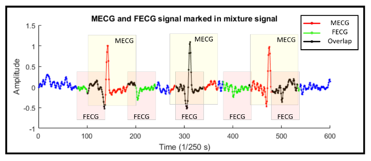
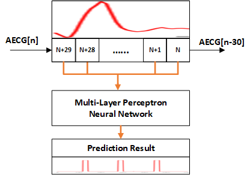
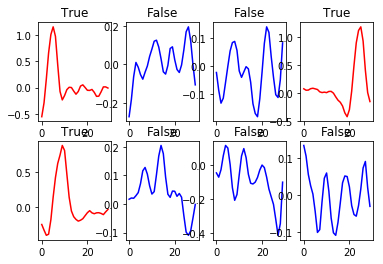
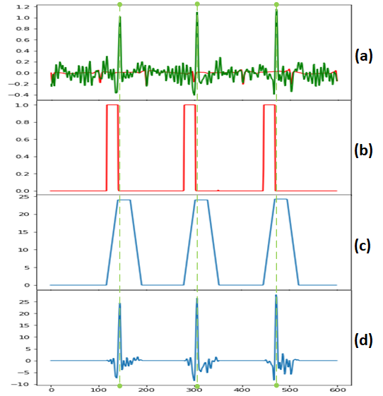
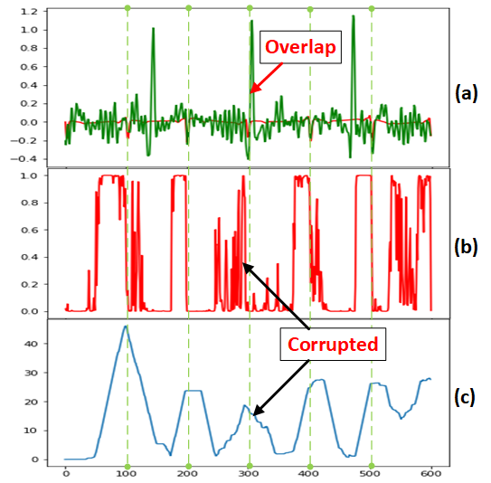

********************************************************
FECG and MECG charachterization using machine learning
********************************************************

.. contents:: Table of Contents
   :depth: 2
   
Introduction
=====================
Fetal Electrocardiography (FECG) signal contains very meaningful information that would help doctors to make decision during pregnancy and labor. It is also an important indicator of the fetal status. However, extracting FECG from non-invasive sensors is not easy since the FECG signal is weak compared to the Maternal ECG (MECG) signal.  In conventional signal processing methods, it requires an adaptive filter with MECG signal and mixture Electrocardiography (ECG) signal to reveal the FECG signal. This procedure requires significant computation power and multiple sensors applied on the pregnant women. As machine learning algorithms become more and more popular, applying neural network to signal processing is widely adapted in all types of applications. This paper presents a method based on neural network to recognize FECG signal from abdominal ECG signal acquired by non-invasive sensors. In this paper, training and evaluation procedure are done in TensorFlow on a heterogeneous platform. This algorithm can precisely identify both MECG and FECG signal from a maternal abdominal ECG signal. 

This figure shows one channel of simulated signals by using FECGSYN in MATLAB. In this setup, the sample rate is set to 250 Hz; Mother’s heart rate is set to 90 beats per minute (bpm) and the fetal heart rate is set to 150 bpm. FECGSYN returns a simulated dataset contains 8 channels of maternal AECG data. The figure is the AECG signal with both MECG and FECG marked with different color. As shown in this figure, the third FECG is completely overlapped with the second MECG signal. The purpose of this algorithm is to detect FECG and MECG in maternal AECG signal by using MLP neural network algorithm.

Training the Neural Network with Tensorflow
====================================================
The neural network training and evaluating process is done by using Google TensorFlow with GPU support [4]. A few python libraries are used to add visualization to the program. A desktop computer is used to run all the tests. It is a heterogeneous platform contains an Intel(R) Core(TM) i7-6700 CPU @ 3.4 GHz and a NVIDIA GeForce GTX 1070 @ 1.506 GHz as an algorithm accelerator.

One of the most important steps of building a neural network is to properly prepare the training input datasets. As it is presented in the next figure, the AECG mixture signal will be passed into a FIFO to be buffered. For each iteration, a new data is inserted into the buffer at the beginning of the queue, the original data in the buffer will be shift towards the end of list by one. The data at the end of the list will be discarded. The data in the buffer will be used as the input of the neural network. By examine a single FECG and MECG signal, the buffer size is set to 30. After the data passed through the trained neural network, it is supposed to detect if there is a FECG or MECG signal in the AECG signal. 

Result
===============

MECG Training Data

MECG Detection Result

FECG Detection Result

Conclusion
==================
In this paper, an MLP neural network algorithm is presented to detect the MECG and FECG signal from the mixture signal acquired using non-invasive sensors. To test the algorithm, an opensource FECG signal simulator FECGSYN is used to generate the mixture signal for training the neural network. This algorithm successfully characterizes MECG and FECG with a single channel AECG mixture signal. Also, with two channels of AECG signals, the neural network can detect FECG signal very accurately.

Reference
==================
[1]	Solum, Thore & Ingemarsson, Ingemar & Nygren, Åke. (1980). The accuracy of abdominal ECG for fetal electronic monitoring. Journal of perinatal medicine. 8. 142-9. 10.1515/jpme.8.3.142, 1980.

[2]	C. S. Lee, M. Masek, C. P. Lam and K. T. Tan, "Towards higher accuracy and better noise-tolerance for fetal heart rate monitoring using Doppler ultrasound," TENCON 2009 - 2009 IEEE Region 10 Conference, Singapore, pp. 1-6, 2009.

[3]	D. Rassi, "Fetal heart monitoring by SQUID magnetometry," IEE Colloquium on Biomagnetic Methods in Medicine, London, pp. 8/1-8/3, 1993.

[4]	Mart´ın Abadi, Ashish Agarwal, Paul Barham, Eugene Brevdo, Zhifeng Chen, Craig Citro, Greg S Corrado, Andy Davis, Jeffrey Dean, Matthieu Devin, et al., “Tensorflow: Large-scale machine learning on heterogeneous distributed systems,” arXiv preprint arXiv:1603.04467, 2016.

[5]	Behar J., Andreotti F., Zaunseder S., Li Q., Oster J. and Clifford G D., An ECG model for simulating maternal-foetal activity mixtures on abdominal ECG recordings. Physiol Meas 35(8), pp.1537-50, 2014

[6]	Andreotti F., Behar J., Zaunseder S.,Oster J. and Clifford G D., An Open-Source Framework for Stress-Testing Non-Invasive Foetal ECG Extraction Algorithms. Physiol Meas 37(5), pp. 627-648, 2016.

[7]	B. Wang and J. Saniie, "Ultrasonic flaw detection based on temporal and spectral signals applied to neural network," 2017 IEEE International Ultrasonics Symposium (IUS), Washington, DC, pp. 1-4, 2017.

[8]	B. Wang and J. Saniie, "Ultrasonic target echo detection using neural network," 2017 IEEE International Conference on Electro Information Technology (EIT), Lincoln, NE, pp. 286-290, 2017.
